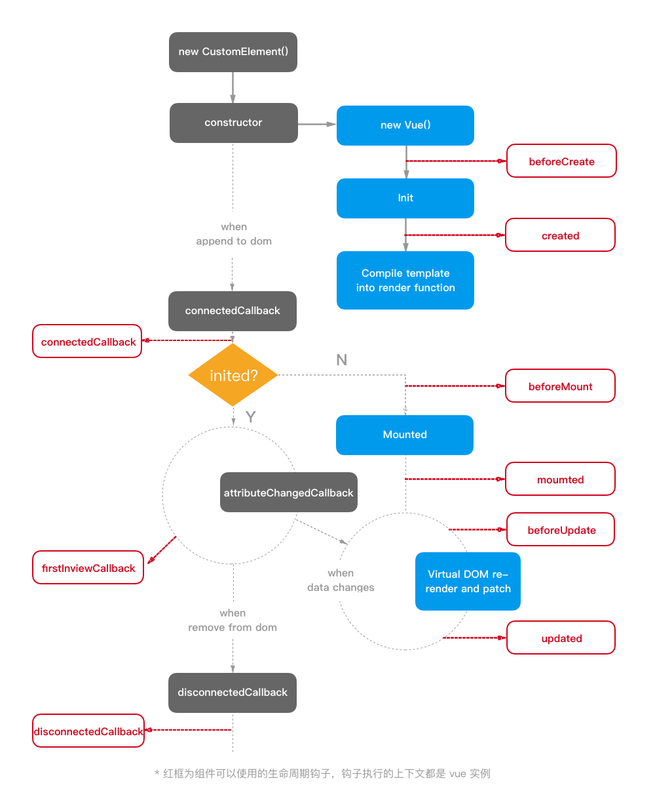

## MIP 2.0 组件实例生命周期和回调钩子

### 组件实例生命周期

mip 自定义元素 (Custom Element) 本质上是基于 [Web Component](https://developer.mozilla.org/en-US/docs/Web/Web_Components/Using_custom_elements) 规范实现的一种用于创建自定 HTML 元素的功能。为了方便开发，mip2 支持开发者使用 vue 的方式 mip 自定义元素，而隐藏了自定义元素注册和生命周期回调，开发者可以完全专注 vue 组件的开发。

你可以定义以下的生命周期回调钩子，这些回调会在自定义元素的生命周期的不同点回调。所有的生命周期钩子自动绑定 this 上下文到 vue 实例中，因此你可以访问数据，对属性和方法进行运算。这意味着 你不能使用箭头函数来定义一个生命周期方法 (例如 created: () => this.fetchTodos())。这是因为箭头函数绑定了父上下文，因此 this 与你期待的 Vue 实例不同，this.fetchTodos 的行为未定义。

- **beforeCreate**: vue 实例准备初始化前调用
- **created**： vue 实例初始化完成后调用
- **beforeMount**: vue 准备挂载到自定义元素下前调用
- **mounted**: vue 挂载到自定义元素后调用
- **beforeUpdate**: vue 数据状态发生变化时调用，如果自定义元素上的属性在 vue 组件定义的 prop 列表里，则自定义元素属性变化会触发 vue 数据状态的变化
- **updated**: vue 重新渲染完成后触发调用
- **firstInviewCallback**: 自定义元素第一次出现在浏览器窗口时触发调用，参数为自定义元素实例
- **connnectedCallback**: 自定义元素挂载到 dom 结构时候调用,参数为自定义元素实例
- **disconnectedCallback**: 自定义元素从 dom 结构移除后调用,参数为自定义元素实例

### 生命周期图示

下图展示了通过 vue 编写 mip 组件实例的生命周期，其中红色框暴露给开发者的生命周期钩子，可以看到除了 firstInviewCallback 钩子，其他钩子都是 vue 的生命周期，这么做也是为了降低学习成本，提高开发效率。

